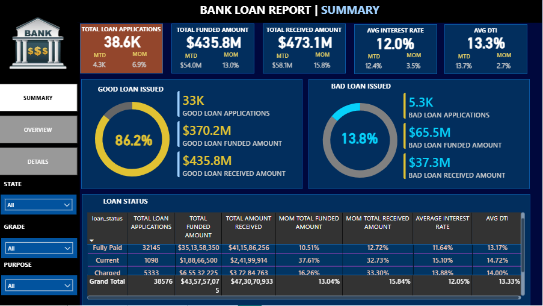

 📊 Bank Loan Analytics Dashboard | Power BI + SQL

 📌 Project Overview
This project is an end-to-end Bank Loan Analysis Dashboard built using SQL and Power BI.

The dashboard analyzes loan applications, funding performance, repayment trends, and risk segmentation (Good vs Bad loans). It provides business insights to help financial institutions monitor loan portfolio health and growth performance.

---

 🎯 Business Objectives
- Track total loan applications and growth trends
- Analyze funded vs received amounts
- Identify Good and Bad loan distribution
- Monitor Month-over-Month (MoM) performance
- Evaluate Interest Rate and Debt-to-Income (DTI)
- Analyze loan distribution by State, Purpose, Term, and Home Ownership

---

 🛠 Tools & Technologies Used
- SQL (Data extraction, cleaning, aggregation)
- Power BI Desktop
- DAX (Data Analysis Expressions)
- Power Query
- Data Modeling
- Interactive Visualizations & Slicers

---

 🗄 SQL Work Performed
SQL queries were used for:
- Data cleaning and validation
- Aggregations (SUM, COUNT, GROUP BY)
- Loan status classification
- MoM calculations
- Performance segmentation

---

 📊 Dashboard Pages

 1️⃣ Overview Page
- KPI Cards (Applications, Funded, Received, Interest Rate, DTI)
- Monthly Funded Trend
- State-wise Loan Distribution (Map)
- Term Distribution
- Purpose & Home Ownership Analysis

 2️⃣ Summary Page
- Good vs Bad Loan Segmentation
- Funded & Received Amount Comparison
- Loan Status Breakdown Table
- MoM Performance Metrics

3️⃣ Details Page
- Transaction-level loan records
- Drill-down capability
- Multi-filter analysis (State, Grade, Loan Type)

---

 📸 Dashboard Preview
🔹 Overview

🔹 Summary

 🔹 Details

---

🚀 How to Use
1. Download the repository
2. Open the `.pbip` file in Power BI Desktop
3. Refresh data if required
4. Explore interactive dashboard

---

 👨‍💻 About Me
Aspiring Data Analyst skilled in SQL and Power BI, focused on building business intelligence dashboards and data-driven solutions.

---

📬 Connect With Me
LinkedIn:  www.linkedin.com/in/ishaan-sharma-420105273
